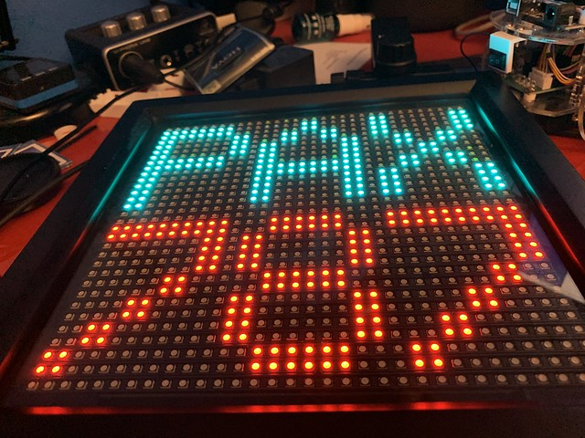
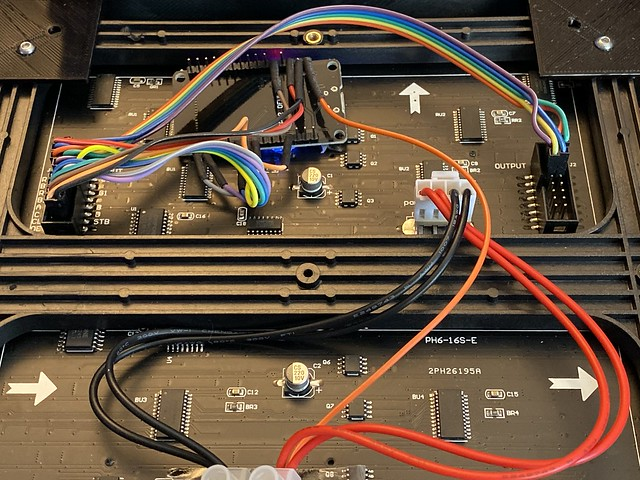

# PAX Counter Display




This program can uses an ESP32 to drive a HUB75 based LED panel to display characters and text. It can display three characters and three numbers. 

The numbers can be retrieved from a PAX counter based on [this design](https://github.com/vrees/pax-counter).

The HUB75 drivers are based on the ones [here](https://github.com/2dom/PxMatrix).



I used a ESP32 based board from [DOIT](https://docs.zerynth.com/latest/official/board.zerynth.doit_esp32/docs/index.html) that works really well. 

You will need to have the PubSubClient library installed to build the program. You *must* make sure that you modify the header for this library to increase the maximum MQTT packet size from the very small default to at least 1000. This is because the messages from the Things Network are rather large. If this size is too small the program will display an error when it starts. To change this value find the file PubSubClient.h (it will be in your Arduino libary) and change package size to 1000:

```
#define MQTT_MAX_PACKET_SIZE 1000 
```


The display is configured using the serial port on your Arduino device. Plug this in and use the Arduino terminal or Visual Studio Serial Monitor to communicate with your display. Settings are expressed as JSON messages and are persisted in the device. You can store up to 5 different WiFi configurations. When the machine is powered on it will display all the commands available:

```
Commmands
device
    ver
      Get the software version of the device
      {"v":1, "c" : "device", "o" : "ver"}
    getdevname
      Get the device name
      {"v":1, "c" : "device", "o" : "getdevname"}
    devname
      {"v":1, "t" : "sensor01", "c" : "device", "o" : "devname", "val":"sensor01"}
      Get and set the device name
    reset
      Reset the device
      {"v":1, "t" : "sensor01", "c" : "device", "o" : "reset"}
commands
    commands
      Enables or disables remote commands
      {"v":1, "t" : "sensor01", "c" : "commands",  "o" : "state", "val":"on"}
mqtt
    publish
      Set the publish topic for any data sent from the device to MQTT
      {"v":1, "t" : "sensor01", "c" : "mqtt", "o" : "publish", "val":"sensor01/data" }
    subscribe
      Set the subscribe topic for any commands sent to the device from MQTT
      {"v":1, "t" : "sensor01", "c" : "mqtt", "o" : "subscribe", "val":"sensor01/commands" }
    id
      Set the MQTT device id
      {"v":1, "t" : "sensor01", "c" : "mqtt", "o" : "id", "val":"sensor01" }
    user
      Set the username for MQTT login
      {"v":1, "t" : "sensor01", "c" : "mqtt", "o" : "user", "val":"username" }
    pwd
      Set the password for MQTT login
      {"v":1, "t" : "sensor01", "c" : "mqtt", "o" : "pwd", "val":"123456" }
    host
      Set the host for MQTT login
      {"v":1, "t" : "sensor01", "c" : "mqtt", "o" : "host", "val":"mqtt.connectedhumber.org" }
    port
      Set the port on the MQTT server
      {"v":1, "t" : "sensor01", "c" : "mqtt", "o" : "port", "val":1883 }
wifi
    on
      Turn WiFi on
      {"v":1, "t" : "Sensor01", "c" : "wifi", "o" : "on"}
    off
      Turn WiFi off
      {"v":1, "t" : "Sensor01", "c" : "wifi", "o" : "off"}
    ssid
      Set SSID for specified WiFi network
      {"v":1, "t" : "sensor01", "c" : "wifi",  "o" : "ssid", "set":0, "val":"ssid"}
    pwd
      Set password for specified WiFi network
      {"v":1, "t" : "sensor01", "c" : "wifi", "o" : "pwd", "set":0, "val":"password"}
status
    status
      Controls the display of the status led
      {"v":1, "t" : "sensor01", "c" : "status",  "o" : "state", "val":"on"}
pax
    text
      Sets the text display
      {"v":1, "t" : "sensor01", "c" : "pax",  "o" : "text", "val":"message"}
    count
      Sets the count value
      {"v":1, "t" : "sensor01", "c" : "pax",  "o" : "count", "val":10}
    devid
      Sets the name of the pax counter device to display
      {"v":1, "t" : "sensor01", "c" : "pax",  "o" : "devid", "val":"rob-sensor"}
```
Each command must be sent as a Json object and terminated by carriage return. 

The payload element of each setting command is used set the value for that setting. If the "val" element is omitted the device will display the current value of that setting. 

After a command has been performed a response message is displayed containing a status value:
```
#define WORKED_OK 0
#define NUMERIC_VALUE_NOT_AN_INTEGER 1
#define NUMERIC_VALUE_BELOW_MINIMUM 2
#define NUMERIC_VALUE_ABOVE_MAXIMUM 3
#define INVALID_HEX_DIGIT_IN_VALUE 4
#define INCOMING_HEX_VALUE_TOO_BIG_FOR_BUFFER 5
#define VALUE_MISSING_OR_NOT_A_STRING 6
#define INCOMING_HEX_VALUE_IS_THE_WRONG_LENGTH 7
#define INVALID_OR_MISSING_TARGET_IN_RECEIVED_COMMAND 8
#define COMMAND_FOR_DIFFERENT_TARGET 9
#define INVALID_OR_MISSING_DEVICE_NAME 10
#define INVALID_DEVICE_NAME_FOR_MQTT_ON 11
#define STRING_VALUE_MISSING_OR_NOT_STRING 13
#define STRING_VALUE_TOO_LONG 14
#define INVALID_LORA_ACCESS_SETTING 15
#define INVALID_COMMAND_NAME 16
#define JSON_COMMAND_COULD_NOT_BE_PARSED 17
#define JSON_COMMAND_MISSING_VERSION 18
#define JSON_COMMAND_MISSING_COMMAND 19
#define JSON_COMMAND_MISSING_OPTION 20
#define INVALID_MQTT_STATUS_SETTING 21
#define INVALID_LORA_STATUS_SETTING 22
#define MISSING_WIFI_SETTING_NUMBER 23
#define INVALID_WIFI_SETTING_NUMBER 24
#define MISSING_GPIO_PIN_NUMBER 25
#define INVALID_GPIO_PIN_NUMBER 26
#define INVALID_STATUS_LED_SETTING 27
#define INVALID_COMMANDS_CONTROL_SETTING 28
#define INVALID_MATRIX_MESSAGE_LENGTH 29
#define MISSING_MATRIX_MESSAGE 30
#define MISSING_MATRIX_DEV_ID 31
#define INVALID_MATRIX_DEVICE_ID_LENGTH 32
```
You can set up to 5 different WiFi setting pairs. These are identified by the set value in the WiFi commands. The devid element of the pax settings is the name on The Things Network of your device. As an example, the commands I use to set the counter up on my home network are as follows:
```
{"v":1, "t" : "sensor01", "c" : "wifi",  "o" : "ssid", "set":0, "val":"MyWiFiSSID"}
{"v":1, "t" : "sensor01", "c" : "wifi", "o" : "pwd", "set":0, "val":"MyWiFiPassword"}
{"v":1, "t" : "sensor01", "c" : "mqtt", "o" : "id", "val":"PAXled" }
{"v":1, "t" : "sensor01", "c" : "mqtt", "o" : "host", "val":"eu.thethings.network" }
{"v":1, "t" : "sensor01", "c" : "mqtt", "o" : "user", "val":"hull-pax-counter" }
{"v":1, "t" : "sensor01", "c" : "mqtt", "o" : "pwd", "val":"ttn-account-v2.myttnappkey" }
{"v":1, "t" : "sensor01", "c" : "mqtt", "o" : "subscribe", "val":"+/devices/+/up" }
{"v":1, "t" : "sensor01", "c" : "pax",  "o" : "devid", "val":"rob-sensor"}
```
You can get the myttnappkey value from the application description on TTN. The user value is the name of your TTN application. The devid must exactly match the sensor you are using. When the sensor is running it will output each MQTT packet received to the serial port, so you can check that that packets are being received. 

Rob Miles